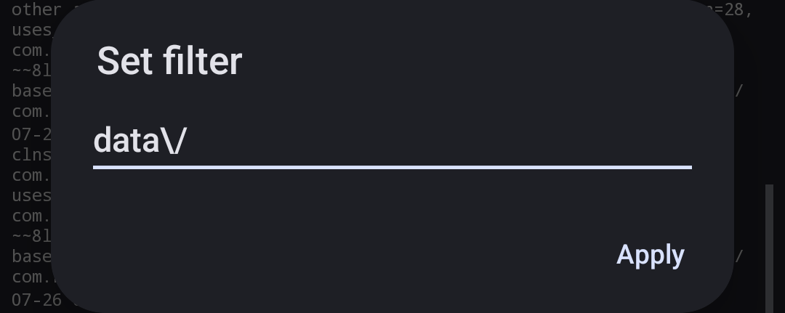
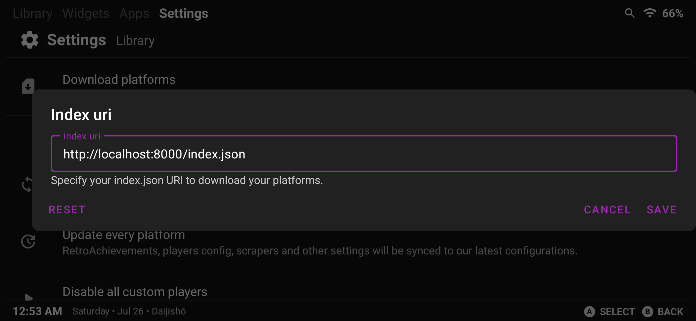

# Daijishō Platforms Index Generator for multi-users in GrapheneOS

If you're using multi-users in GrapheneOS, you'll find all the paths from the [Daijishō](https://github.com/TapiocaFox/Daijishou) index are wrong, this is because all paths need to be renamed in the following manner:

- `/data/app/` -> `/data/app/~~[random1]==/com.retroarch-[random2]==/`
- `/data/data/` -> `/data/user/[user_number]/`
- `/storage/emulated/0/` -> `/storage/emulated/[user_number]/`

This project automatically does this for you, generating a directory that you can host yourself.

## Usage

Be sure to have NodeJS installed in your machine, and just run the `generate.js` script with the following arguments:

```
node ./generate.js [user_number] [random1] [random2] (optional: server_url)
```

All these arguments can be found by running RetroArch, and seeing the app logs (Apps > Retro Arch > Application info > View logs), and searching for `data\/`.

;

After executing, an `out/` directory will be generated. Directory that you can upload to your own github repo, or serve through a local server in your phone (with an app like [Transfer](https://github.com/matan-h/Transfer) for example).

;

## Contributing

If the Daijishō platform index gets updated, let me know with an [issue](https://github.com/LuanHimmlisch/Daijishou-Index-Gen-GrapheneOS/issues).
